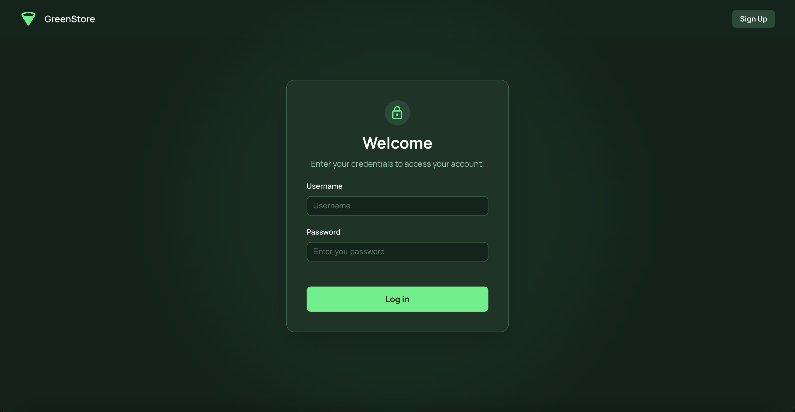

## Screenshots

## How to run

You need node version `22+`. I used node 24 in development but node 22 should be fine.
If you have `nvm`, you can do `nvm install 24` `nvm use 24` to easily switch to node 24.

First install the dependencies by running `npm install`

Then, to run in production mode, use `npm run build` then `npm run preview`

To run in dev mode, use `npm run dev`.

## Apis

I used `msw` to mock the api layer, so there is no need to run something other than the frontend host. `msw` works by intercepting network calls using a service worker.

## Design decisions

### Structure 

I've split the code into 4 layers: api (satisfies the backend), design (satisfies the design), app (satisfies both the backend, the design and the app's logic like routing and initialization) and lib (shared services and utilities)

The dependency rule is: 
- app can depend on api, design and lib (app can depend on any group - it's where the core features are implemented)
- api can only depend on lib
- design can only depend on lib

I am not religious about this structure, and probably in a real big application dependencies would need to mix a bit, but I find that it helps unify the decision on how to compose components.

You can another folder in the root called feature, this belongs in the app group since it's free to use all other groups. It's in root because it's easier to access.

I considered a feature a page, so i followed next.js app router structure for url matching to represent also where this feature is rendered.
`features/_shared` contain component that are shared between features. Ideally features should not use each other, and if something needs to be shared between them, I lift it up to the `_shared/` folder.

For naming conventions I followed kebab-case because I allow a file to export more than 1 react component. I want to keep the files count small while grouping related things together.

Finally I try to not export things that are used in 1 place because when scaled the global module gets messy.

## Styling

The app is fully responsive. I used fluid design and `postcss-pxtorem` to automatically convert almost all px values to rem.

I added a theme but due to time constraints i started hardcoding some values. However the theme is fully spported with typescript intellicense and dynamic variables.

The theme can change and it is built to support that, but because I ran out of time I left both the dark and light themes using the same palettes.

Linaria adds vendor prefix so I didn't use any other plugin for that.

I used radix unstyled primitives for the good composition and accessibility they offer, and implemented my own design theme.
I am using Linaria which is a zero runtime css in js library and used it to inject my theme structure (inspired by mui theme). 
So all the css in the application is statically generated at build time.

### Auth

Auth is implemented using an HttpOnly session cookie. It is handled in my msw handlers

### fetch

I was planning to add axios and intercept network calls but I ran out of time and stuck to using a `wrappedFetch` that handles http error http responses.

### Server State

I used react query for the server state, and kept id the single source of truth so I didn't use a store for authorization.

## Comments

I focused mainly on the products and login pages, this is where I followed best practices for components composition and accessibility. I added listing, pagination, filtering, decent image optimization, and used react query to represent the server state, and msw and a mock to abstract the backend layer.

But in other pages, even in login and products pages, there is room for improvement in reusability and code structure, but I was iterating fast and I was planning to refactor a little at the end if I still had time.

Regarding the size of the mock data, I added 40 items because I am currently rendering about 6 to 10 products at once on ui and the pagination is done on the backend server (msw api), so adding more items would not slow down the ui. That is also why so I only implemented pagination without virtualization (that I would have done with react virtuozo).
